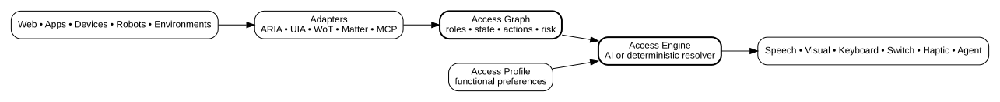

# Access Graph Protocol (AGP)

[](https://github.com/autoflow541/access-graph-protocol/actions/workflows/test.yml)
[](CHANGELOG.md)
[](LICENSE)
[](ROADMAP.md)

**Experimental draft — version 0.1**

Access Graph Protocol is an open interoperability experiment for exposing the **meaning, state, actions, relationships, and safety characteristics** of software, devices, robots, and environments in a common machine-readable form.

The goal is simple: a product exposes what it *is* and what a person *can do with it*; assistive technology or an AI access engine decides how that interaction should be presented to the individual.

AGP does **not** replace ARIA, operating-system accessibility APIs, Matter, W3C Web of Things, authentication, or safety controls. It is intended to bridge them.



## Why this exists

Accessibility is fragmented across browsers, operating systems, assistive technology, smart devices, and physical systems. Each platform has useful semantics, but there is no single accessibility-oriented interaction model that spans a web button, an application control, a kiosk, a thermostat, and a robot action.

AGP explores whether those systems can be normalized into one small semantic graph that an assistive client can consume.

## Core model

An AGP object has a stable identity, semantic role, human-readable label, state, and actions. Safety-sensitive actions can require confirmation and authorization.

```json
{
  "agp": "0.1",
  "id": "front-door",
  "role": "door",
  "label": "Main entrance",
  "state": { "locked": true },
  "actions": [
    {
      "id": "unlock",
      "label": "Unlock door",
      "risk": "medium",
      "confirmation": true
    }
  ]
}
```

A separate **Access Profile** describes functional interaction preferences without requiring a diagnosis:

```json
{
  "agp_profile": "0.1",
  "input": { "preferred": ["voice", "keyboard"] },
  "output": { "preferred": ["speech", "large_text"] },
  "language": { "complexity": "plain", "response_length": "short" }
}
```

## Repository

- `specification/AGP-0.1.md` — current protocol draft
- `schema/` — JSON Schemas for AGP objects and Access Profiles
- `sdk/javascript/` — dependency-free JavaScript reference SDK
- `adapters/aria/` — first ARIA/HTML-to-AGP adapter
- `adapters/wot/` — W3C Web of Things Thing Description adapter
- `adapters/specs/` — SPECS presentation and action-safety bridge
- `examples/website/` — adaptive web demo
- `examples/drone/` — simulated physical-system demo using the same model
- `examples/smart-device/` — WoT thermostat and SPECS-view simulator
- `examples/specs/` — Lens Studio porting contract, controller, and a real Lens Studio (SPECS/Spectacles) project source tree in `examples/specs/lens-project/`
- `examples/execution-client/` — a real browser client for `service/` over the network (not an in-process simulation, unlike the three examples above)
- `service/` — server-side execution authority (started, not finished): device/caller allowlisting, proposal lifecycle, state-version and duplicate-dispatch protection, over a dependency-free HTTP layer — see `service/README.md`
- `tests/` — SDK, adapter, and execution-service tests
- `docs/prior-art-and-positioning.md` — how AGP relates to Universal Remote Console, W3C WoT, AccessKit, WAI-Adapt, MCP, Apple App Intents, A2UI, and XR accessibility research
- `docs/capability-matrix.md` — what's actually implemented today, per adapter and client, verified against source
- `docs/adr-0001-wot-reuse.md` — the architecture decision on reusing WoT (and Matter, Home Assistant) rather than competing with them
- `docs/audit-2026-09-22.md` — engineering audit and prioritized feature/pilot plan
- `ROADMAP.md` — prototype-to-standardization roadmap, including a milestone plan with acceptance criteria

## Run it

Requires a recent Node.js version for tests. The browser demos have no package dependencies.

```bash
npm test
python -m http.server 8080
```

Then open:

- `http://localhost:8080/examples/website/`
- `http://localhost:8080/examples/drone/`
- `http://localhost:8080/examples/smart-device/`

`examples/execution-client/` is different from the three above: it is a
real network client, not an in-process simulation. It requires the
execution service running separately:

```bash
npm run service:dev
python -m http.server 8080   # in another terminal
```

Then open `http://localhost:8080/examples/execution-client/`. See
`service/README.md`.

## ARIA adapter

The first adapter converts existing HTML and ARIA semantics into AGP objects.

```js
import { scanAria } from "./adapters/aria/index.js";

const objects = scanAria(document);
```

It currently recognizes common interactive controls including buttons, links, text inputs, checkboxes, radio buttons, selects, textareas, and elements with explicit ARIA roles. It intentionally avoids exposing password values.

## WoT and SPECS interoperability

The WoT adapter maps Thing Description properties, actions, events, and security declarations into AGP without taking over transport or credentials. Unknown writes and device actions fail safe: they default to medium risk and explicit confirmation, and for `physical_safety`/`security`/`financial`/`destructive` categories a source-declared risk or confirmation value can only raise the effective requirement, never lower it below a policy floor — see `SECURITY.md` and `docs/capability-matrix.md`.

The SPECS adapter converts the same AGP object and Access Profile into a world-panel view model and a gated action session suitable for a Lens. It supports hand/voice selection, captions, speech, large text, high contrast, reduced motion, and one-step flows at the semantic layer, and binds an action's parameters into an immutable, deep-frozen proposal at request time — confirming an action confirms the exact parameters that will run, not just the action id. `examples/specs/lens-project/` builds on this with real Lens Studio TypeScript source for Lens Studio 5.22+ / SPECS 27, Spectacles UI Kit, and the Spectacles Interaction Kit; it still needs on-device testing — see `examples/specs/lens-project/SETUP.md`.

## Design principles

1. **Meaning before presentation.** Describe capability, not a particular UI.
2. **Functional preferences before diagnoses.** Share only what is needed for the interaction.
3. **Structured data before inference.** Native semantics outrank AI guesses.
4. **Safety is not an accessibility preference.** Accessibility must never bypass authorization or physical safety controls.
5. **Interoperate, do not replace.** Existing accessibility and device standards remain authoritative in their domains.

## Status

AGP 0.1 is an independent experimental prototype, not an approved standard and not affiliated with W3C, WHATWG, the Connectivity Standards Alliance, or any other standards body.

The current proof applies one Access Profile across a website, a WoT smart device, a simulated drone, and a SPECS-oriented XR presentation with real Lens Studio source. Native on-device testing and OS accessibility adapters remain future work.

## License

Apache License 2.0. See `LICENSE`.

## Current engineering audit

See [the implementation audit](docs/audit-2026-09-22.md) for verified fixes, open limitations, prioritized features and pilot acceptance criteria. [NEXT.md](NEXT.md) scopes the execution-service milestone.
